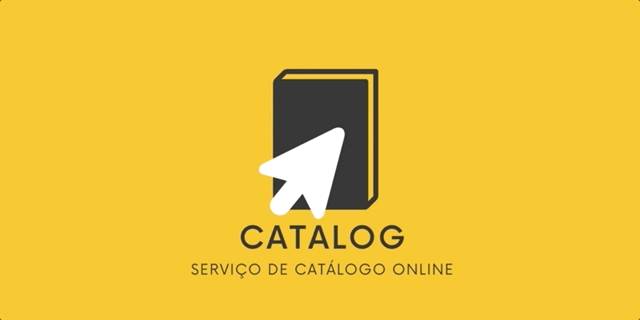
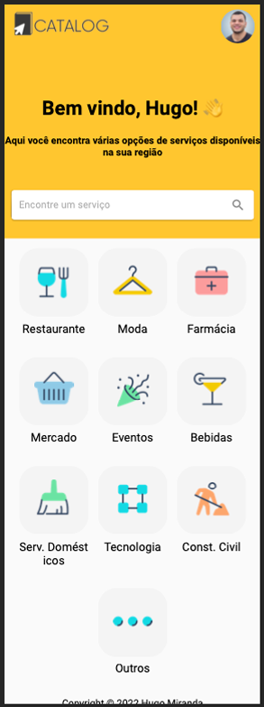
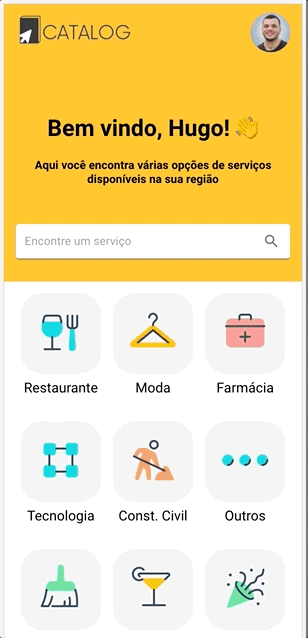
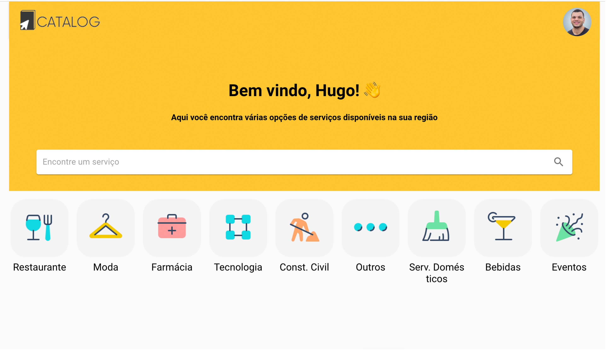

<h1 align="center">
    
</h1>

<h4 align="center"> 
	📒 CATALOG - Catálogo de Serviços Online

 <a href="#-sobre-o-projeto">Sobre</a> •
 <a href="#-funcionalidades">Funcionalidades</a> •
 <a href="#-layout">Layout</a> • 
 <a href="#-tecnologias">Tecnologias</a> • 
 <a href="#-autor">Autor</a> • 
 <a href="#user-content--licença">Licença</a> • 
  <a href="#-live">Live</a>

## 💻 Sobre o projeto

CATALOG é um catálogo de serviços online, onde as empresas podem se cadastrar para disponibilizar suas informações, produtos e serviços para que os usuários possam encontrá-los.

O projeto foi desenvolvido no último módulo do Bootcamp de Desenvolvimento Web da [Ironhack](https://www.ironhack.com/)

---

## ⚙️ Funcionalidades

- [x] Empresas ou entidades podem:

  - [x] Se cadastrar, informando sua descrição e suas informações de contato
  - [x] Cadastrar os produtos e serviços que oferece
  - [x] Cadastrar ofertas e promoções
  - [x] Logar no sistema e administrar produtos e serviços pelo painel de controle

- [x] Os usuários podem:
  - [x] Ser cadastrar
  - [x] Logar no sistema

---

## 🎨 Layout

O layout da aplicação está disponível no Figma:

### Mobile

  

  

### Web

  

---

## 🛠 Tecnologias

As seguintes ferramentas foram usadas na construção do projeto:

#### **Website** ([React](https://reactjs.org/))

- **[React Router Dom](https://github.com/ReactTraining/react-router/tree/master/packages/react-router-dom)**
- **[Material UI](https://mui.com/)**
- **[Axios](https://github.com/axios/axios)**

#### **Server** ([NodeJS](https://nodejs.org/en/))

-**[Repositório do Servidor](https://github.com/hugolomba/final-project-backend)**

- **[Express](https://expressjs.com/)**
- **[CORS](https://expressjs.com/en/resources/middleware/cors.html)**
- **[MongoDB](https://www.mongodb.com/)**
- **[mongoose](https://mongoosejs.com/)**
- **[dotENV](https://github.com/motdotla/dotenv)**
- **[Multer](https://github.com/expressjs/multer)**

---

## 💪 Como contribuir para o projeto

1. Faça um **fork** do projeto.
2. Crie uma nova branch com as suas alterações: `git checkout -b my-feature`
3. Salve as alterações e crie uma mensagem de commit contando o que você fez: `git commit -m "feature: My new feature"`
4. Envie as suas alterações: `git push origin my-feature`

---

## 🦸 Autor

 
  
 <b>Hugo Miranda</b>
  

---

## 📝 Licença

Este projeto esta sobe a licença [MIT](./LICENSE).

Feito com ❤️ por Hugo Miranda 👋🏽 [Entre em contato!](https://www.linkedin.com/in/hugolomba/)

---

## 🌐 Live

https://catalog.hugomiranda.me/
